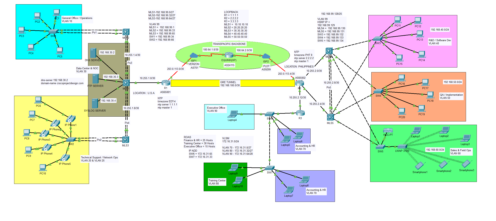

# Enterprise-WAN-Topology-US-to-Philippines
This project simulates a dual-site enterprise WAN connecting a **US headquarters** (AS65001) to a **Philippines offshore corporate site** (AS65002) via a simulated transpacific backbone through an IXP (Equinix, AS24115), using Verizon (AS701) and PLDT (AS9299) as the respective ISPs.

Designed to explore and apply real-world BGP, WAN architecture, GRE tunneling, and multilayer switching beyond the standard CCNA curriculum.

> **Disclaimer:** ISP names (Verizon, PLDT) and Equinix are used for educational simulation only. No affiliation or endorsement is implied. Public IPs follow RFC 5737 (203.0.113.x) and RFC 6598 (100.64.x.x) documentation standards.

## Topology

---

## Device Summary

| Device | Role | Loopback | Location |
|---|---|---|---|
| R1 | US edge router, BGP AS65001, NTP master | 1.1.1.1 | USA |
| R2 | PH edge router, BGP AS65002, NTP master | 2.2.2.2 | Philippines |
| R3 | PH branch router, ROAS (VLANs 70/80/90), NTP ref | 3.3.3.3 | Philippines |
| ISP1 | Verizon simulation, AS701 | — | USA |
| IXP | Equinix simulation, AS24115 | — | Transit |
| ISP2 | PLDT simulation, AS9299 | — | Philippines |
| MLS1 | Distribution/core, VLAN 30, loopback 10.10.10.10 | 10.10.10.10 | USA |
| MLS2 | Distribution, VLANs 10/99 | 20.20.20.20 | USA |
| MLS3 | Distribution, VLANs 20/25/99 | 30.30.30.30 | USA |
| MLS4 | Distribution, VLANs 40/50/60/99, HSRP Active | 40.40.40.40 | Philippines |
| MLS5 | Distribution, VLANs 40/50/60/99, HSRP Standby | 50.50.50.50 | Philippines |
| SW1–SW2 | Access layer, US site | — | USA |
| SW3–SW5 | Access layer, PH core site | — | Philippines |
| SW6–SW7 | Access layer, PH branch site | — | Philippines |

---

## Feature Details

### Routing & WAN
| Feature | Detail |
|---|---|
| BGP | R1 (AS65001) ↔ ISP1 (AS701) ↔ IXP (AS24115) ↔ ISP2 (AS9299) ↔ R2 (AS65002) |
| GRE Tunnel | Tunnel0 on R1 (192.168.100.1) and R2 (192.168.100.2), MTU 1476 |
| OSPF | Process 100, Area 0, router-IDs via loopbacks, default-information originate on R1 and R2 |
| ROAS | R3 Gi0/0.70 / .80 / .90 with dot1Q encapsulation |
| NAT | PAT on R1 (Gi0/0/0) and R2 (Gi0/0/0) using ACL 1 |
| Static routes | Cross-tunnel routes on both R1 and R2 for full cross-site reachability |
| WAN links | Serial interfaces with bandwidth and clock rate configured (simulating submarine fiber) |

### Switching
| Feature | Detail |
|---|---|
| EtherChannel | Po1–Po5 using LACP (mode active) across MLS1–MLS5, SW1, SW2 |
| Trunking | 802.1Q, native VLAN 1010 on all trunk links |
| Rapid-PVST | MLS4 root for VLANs 40/50 (priority 24576), MLS5 root for VLANs 60/99 (priority 24576) |
| Voice VLAN | VLAN 25 on SW2 with maximum 2 MACs per port for IP phone + PC |

### Layer 2 Security
| Feature | Detail |
|---|---|
| DHCP Snooping | Enabled on SW1 (VLANs 10/99), SW2 (20/25/99), SW3 (40/99), SW4 (50/99), SW5 (60/99) |
| Dynamic ARP Inspection | src-mac + dst-mac + IP validation; uplinks marked as trusted |
| Port Security | Sticky MAC, restrict violation, on all access ports |
| BPDUGuard + PortFast | Applied to all access ports |
| Native VLAN hardening | Native VLAN 1010 (unused) on all trunks to prevent VLAN hopping |
| SSH ACL | SSH_ACCESS applied to all VTY lines — permits only VLANs 20, 25, and 99 subnets |

### Redundancy & Services
| Feature | Detail |
|---|---|
| HSRP | Version 2, groups 1–4 on MLS4/MLS5 for VLANs 40/50/60/99; MLS4 active (priority 110 + preempt) |
| DHCP | R1 serves US VLANs 10/20/25/99; R2 serves PH VLANs 40/50/60/99 with option 43 for WLC |
| ip helper-address | Configured on all SVIs pointing to R1 (1.1.1.1) or R2 (2.2.2.2) |
| NTP | R1 = master for US site; R2 = master for PH core; R3 loopback (3.3.3.3) = NTP ref for PH branch |
| Syslog | All devices log to 192.168.30.4 (Syslog Server, VLAN 30) |
| DNS | 192.168.30.2 (DNS Server, VLAN 30), domain ciscoprojectdesign.com |
| Wireless | WLC-PT with CAPWAP, DHCP option 43 pointing to 192.168.99.135 |

---

## VLAN Table

| VLAN | Name | Subnet | Site |
|---|---|---|---|
| 10 | General Office / Operations | 192.168.10.0/24 | USA |
| 20 | Technical Support (Data) | 192.168.20.0/24 | USA |
| 25 | Technical Support (Voice) | 192.168.25.0/24 | USA |
| 30 | Data Center / NOC | 192.168.30.0/28 | USA |
| 40 | R&D / Software Dev | 192.168.40.0/24 | Philippines |
| 50 | QA / Implementation | 192.168.50.0/24 | Philippines |
| 60 | Sales & Field Ops | 192.168.60.0/24 | Philippines |
| 70 | Accounting & HR (branch) | 172.16.31.0/27 | Philippines |
| 80 | Training Center (branch) | 172.16.31.32/27 | Philippines |
| 90 | Executive Office (branch) | 172.16.31.64/28 | Philippines |
| 99 | Management | 192.168.99.0/27 to /128 (per segment) | Both |

---

## Key Challenges & Lessons Learned

- **Double NAT** between R1 and R2 broke end-to-end connectivity — solved with a GRE tunnel
- **OSPF over GRE** is unsupported in Packet Tracer — worked around with static routing through the tunnel
- **WLC instability** — CAPWAP and DHCP option 43 were correctly configured, but PT's WLC GUI crashes frequently; wireless clients fall back to VLAN 99 addresses
- **HSRP flapping** — resolved by shutting physical interfaces on MLS4/MLS5, not the SVIs
- **NTP hierarchy** — built a three-tier NTP design: R1/R2 as masters → MLS/access switches → R3 as branch NTP reference for SW6/SW7

---

## Verification Screenshots

### Routing

### Switching

### Redundancy & Services

### Security

### End-to-End Connectivity

---

## Tools Used

- Cisco Packet Tracer 8.2.2

---

## Author

**Richard Buenconsejo**
BS Electronics & Communications Engineering | CCNA (CSCO14468070)

[LinkedIn](https://www.linkedin.com/in/richard-buenconsejo-62ab3922a/)

---

*This is a fictional topology built for educational purposes. All configurations reflect real-world practices studied through CCNA coursework and independent research.*
